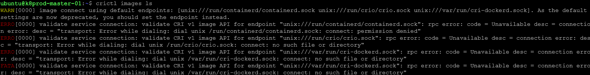
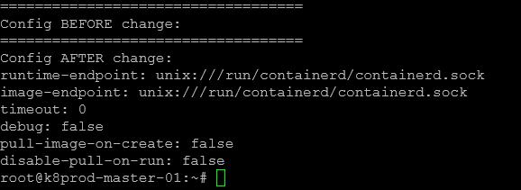
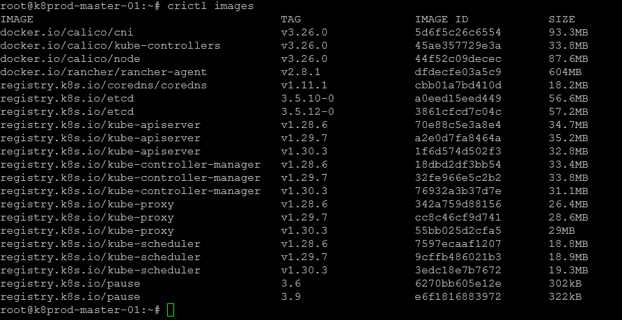

# How to Fix the "Error while dialing dial unix /var/run/dockershim.sock" Error in Kubernetes



## Description

This guide provides solutions for resolving the error message "Error while dialing dial unix /var/run/dockershim.sock," which typically occurs when Kubernetes components attempt to interact with Docker but cannot access the Docker socket.

## Steps 🔧:-

To resolve the error mentioned earlier, I reconfigured the crictl endpoint to utilize the containerd runtime instead of the Dockershim. I accomplished this by executing the following commands:

```bash
touch /etc/crictl.yaml
echo "===================================" &&\
echo "Config BEFORE change:" &&\
sudo cat /etc/crictl.yaml &&\
sudo crictl config --set runtime-endpoint=unix:///run/containerd/containerd.sock --set images/image-endpoint=unix:///run/containerd/containerd.sock &&\
echo "===================================" &&\
echo "Config AFTER change:" &&\
sudo cat /etc/crictl.yaml
```

Sample Output:



After executing the commands above, I attempted to list the images/images again using the crictl images/images command, and to my satisfaction, it executed successfully.



The output indicates that the previous error regarding dialing unix /var/run/dockershim.sock has been resolved, allowing us to use the crictl container runtime interface CLI effectively.

However, there may be instances where you are using the correct container runtime but still encounter the same error. In such cases, I recommend restarting the container runtime service to see if that resolves the issue. For example, if you are using the containerd runtime, you can restart the service with the following command:

```bash
systemctl restart containerd
```

I hope the solution provided above will help you resolve your error as well. If you continue to experience issues, please let me know in the comments, and I would be happy to assist you further.

## Final Note

If you find this repository useful for learning, please give it a star on GitHub. Thank you!

**Authored by:** [ELemenoppee](https://github.com/ELemenoppee)