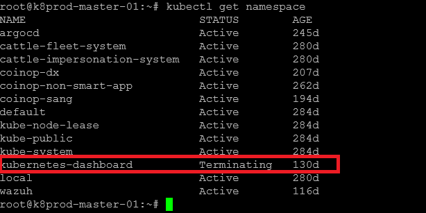
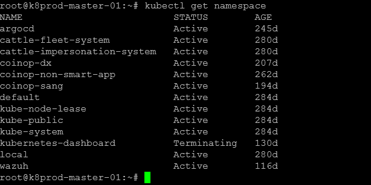
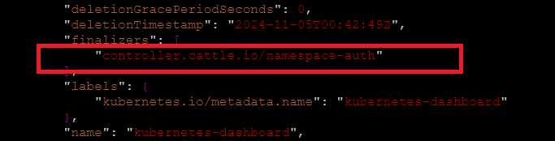
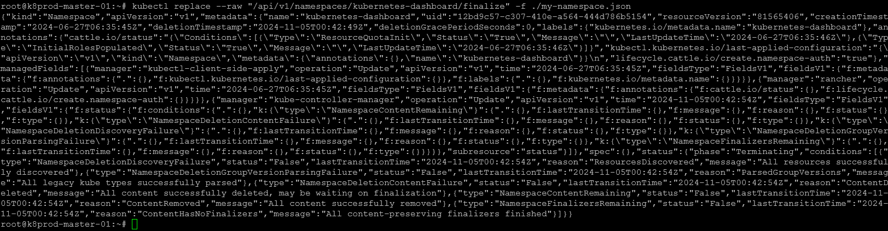
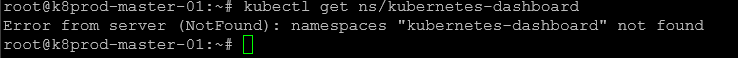

# Deleting a Kubernetes Namespace Stuck in Terminating Status



## Description

This guide provides a detailed, step-by-step process to resolve the issue of a Kubernetes namespace stuck in the "Terminating" status, which can occur when resources or finalizers block the deletion process.

## Prerequisites

Before you begin, ensure you have the following:

+ Kubectl Access: Ensure that kubectl is installed and configured to manage your Kubernetes cluster.

+ Namespace Permission: You need permission to edit and delete namespaces within the cluster.

## Steps :-

### List All Namespaces

Run the following command to display all namespaces in your cluster:

```bash
kubectl get namespaces
```

Example output:



### Export the Namespace Configuration

Create a JSON file for the namespace you want to delete (in this case, kubernetes-dashboard):

```bash
kubectl get ns/kubernetes-dashboard -o json > my-namespace.json
```

### Remove Finalizers

Open my-namespace.json and delete the finalizers section. This will help bypass any blocking finalizers preventing deletion.



### Send a Request to Delete the Namespace

After editing, use the following command to replace the namespace configuration and finalize the deletion:

```bash
kubectl replace --raw "/api/v1/namespaces/kubernetes-dashboard/finalize" -f ./my-namespace.json
```

Example response:



### Verify Deletion

Check if the namespace has been successfully deleted:

```bash
kubectl get ns/kubernetes-dashboard
```

Sample Result:



Following these steps should resolve the issue of a namespace stuck in "Terminating" status.