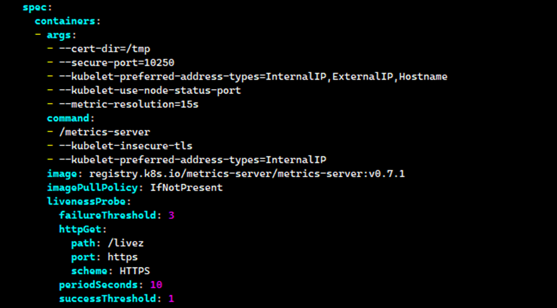

# 🧪 How to Fix the "Metrics API Not Available" Error in Kubernetes

## Description

Encountering the "Metrics API not available" error in your Kubernetes cluster? This comprehensive guide will walk you through the process of diagnosing and resolving this issue, ensuring you can effectively monitor and manage your cluster's performance metrics.

## Steps 🔧:-

**Step 1** — Login to Master Node

**Step 2** — Deploy metrics-server yaml file

```
$ kubectl apply -f https://github.com/kubernetes-sigs/metrics-server/releases/latest/download/components.yaml
```

Sample Result:

```
serviceaccount/metrics-server created
clusterrole.rbac.authorization.k8s.io/system:aggregated-metrics-reader created
clusterrole.rbac.authorization.k8s.io/system:metrics-server created
rolebinding.rbac.authorization.k8s.io/metrics-server-auth-reader created
clusterrolebinding.rbac.authorization.k8s.io/metrics-server:system:auth-delegato
clusterrolebinding.rbac.authorization.k8s.io/system:metrics-server created
service/metrics-server created
deployment.apps/metrics-server created
apiservice.apiregistration.k8s.io/v1beta1.metrics.k8s.io created
```

**Step 3** — Verify if the metrics-server pod has been created

```
$ kubectl get pods -n kube-system
```

Result:

```
root@sandbox-dev-master-01:~# kubectl get pods -n kube-system
NAME                                            READY   STATUS    RESTARTS
metrics-server-6d94bc8694-5dnmd                 0/1     Running   0
```

**Note:** Make sure that the status is 1/1, if not proceed to the next steps.

**Step 4** — Modify the metrics-server configuration file

```
$ kubectl edit deployment metrics-server -n kube-system
```

Add the following lines:

```
        command:
        - /metrics-server
        - --kubelet-insecure-tls
        - --kubelet-preferred-address-types=InternalIP
```

For Example:



After modifying yaml file, wait until the metrics-server pod status is changed to 1/1.

From:

```
root@sandbox-dev-master-01:~# kubectl get pods -n kube-system
NAME                                            READY   STATUS    RESTARTS
metrics-server-6d94bc8694-5dnmd                 0/1     Running   0
```

To:

```
root@sandbox-dev-master-01:~# kubectl get pods -n kube-system
NAME                                            READY   STATUS    RESTARTS
metrics-server-777dff589b-6kq2f                 1/1     Running   0
```

**Step 5** — Verify if the 'kubectl top nedes' and 'kubectl top pods' has a result

```
$ kubectl top nodes
```

Result:

```
root@sandbox-dev-master-01:~# kubectl top nodes
NAME                     CPU(cores)   CPU%   MEMORY(bytes)   MEMORY%
sandbox-dev-master-01    771m         19%    6353Mi          82%
sandbox-k8devworker      48m          0%     2740Mi          71%
sandbox-k8devworker-02   135m         3%     3978Mi          51%
```

## Final Note

If you find this repository useful for learning, please give it a star on GitHub. Thank you!

**Authored by:** [ELemenoppee](https://github.com/ELemenoppee)