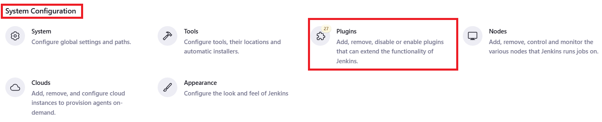

# How to Fix the "No such DSL method 'sshagent' found among steps" Error in Jenkins

## Description 

Encountering the "No such DSL method 'sshagent' found among steps" error in Jenkins? This detailed guide will walk you through diagnosing and resolving this issue, ensuring you can effectively use the sshagent step in your Jenkins pipelines.

## Steps 👓:-

Login to Jenkins your Jenkins Server

Go to "Manage Jenkins"

Under "System Configuration", click on "Plugins".

Click on "Available plugin", search for "SSH Agent" and Install.

